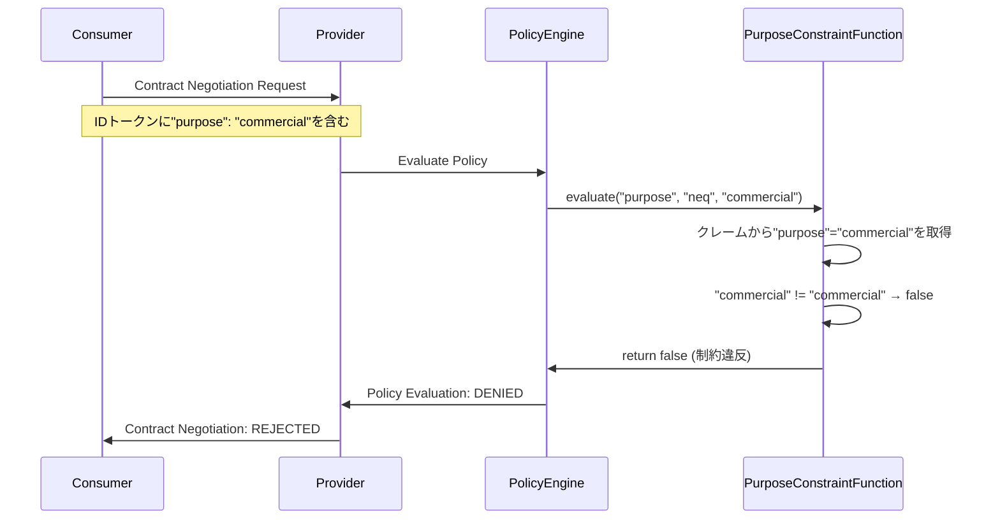

# EDC ポリシー評価タイミングガイド
## Purpose制約の評価はいつ・どのように行われるか？

### 📋 概要
EDCでは、`purpose`のような制約値は**コントラクト交渉時**に参加者の**クレーム（Claims）**から取得され評価されます。しかし、**デフォルトでは`purpose`制約の評価機能は実装されていません**。これを有効にするには、カスタムの制約評価関数を実装・登録する必要があります。

### 🔍 重要なポイント

#### ⚠️ **現状の制限**
- **`purpose`制約は標準で評価されない**: EDCは`purpose`制約の評価関数を提供していません
- **クレームベースの評価**: 参加者のIDトークンに含まれるクレームから値を取得
- **カスタム実装が必要**: `purpose`制約を使用するには、独自の評価関数を作成する必要があります

---

## 🕐 ポリシー評価のタイミング

### **1. コントラクト交渉時 (Contract Negotiation)**
```
Consumer Request → Provider Policy Evaluation → Accept/Reject
```

#### **評価される制約**
- ✅ **時間制約**: `dateTime`、`elapsedTime`
- ✅ **地理制約**: `spatial`、`location` (カスタム実装例あり)
- ❌ **目的制約**: `purpose` (カスタム実装が必要)

#### **評価コンテキスト**
```java
public boolean evaluate(Operator operator, Object rightValue, 
                       Permission rule, ContractNegotiationPolicyContext context) {
    // 参加者のクレームから値を取得
    var participantClaims = context.participantAgent().getClaims();
    var actualPurpose = participantClaims.get("purpose");
    
    return evaluateConstraint(operator, rightValue, actualPurpose);
}
```

### **2. データアクセス時 (Data Access)**
- **EDRトークン検証**: EndpointDataReferenceの有効性確認
- **プロキシレベル制御**: カスタムプロキシでの追加制約確認

---

## 🛠️ Purpose制約の実装方法

### **Step 1: PurposeConstraintFunction の作成**

```java
package org.eclipse.edc.sample.extension.policy;

import org.eclipse.edc.connector.controlplane.contract.spi.policy.ContractNegotiationPolicyContext;
import org.eclipse.edc.policy.engine.spi.AtomicConstraintRuleFunction;
import org.eclipse.edc.policy.model.Operator;
import org.eclipse.edc.policy.model.Permission;
import org.eclipse.edc.spi.monitor.Monitor;

import java.util.Collection;
import java.util.Objects;

public class PurposeConstraintFunction implements AtomicConstraintRuleFunction<Permission, ContractNegotiationPolicyContext> {
    
    private final Monitor monitor;
    
    public PurposeConstraintFunction(Monitor monitor) {
        this.monitor = monitor;
    }
    
    @Override
    public boolean evaluate(Operator operator, Object rightValue, Permission rule, ContractNegotiationPolicyContext context) {
        // 参加者のクレームから目的を取得
        var purpose = context.participantAgent().getClaims().get("purpose");
        
        monitor.info(String.format("Evaluating purpose constraint: %s %s %s", 
                                  purpose, operator, rightValue));
        
        return switch (operator) {
            case EQ -> Objects.equals(purpose, rightValue);
            case NEQ -> !Objects.equals(purpose, rightValue);
            case IN -> ((Collection<?>) rightValue).contains(purpose);
            case IS_ANY_OF -> ((Collection<?>) rightValue).contains(purpose);
            case IS_NONE_OF -> !((Collection<?>) rightValue).contains(purpose);
            default -> {
                monitor.warning("Unsupported operator for purpose constraint: " + operator);
                yield false;
            }
        };
    }
}
```

### **Step 2: 制約関数の登録**

```java
package org.eclipse.edc.sample.extension.policy;

import org.eclipse.edc.connector.controlplane.contract.spi.policy.ContractNegotiationPolicyContext;
import org.eclipse.edc.policy.engine.spi.PolicyEngine;
import org.eclipse.edc.policy.engine.spi.RuleBindingRegistry;
import org.eclipse.edc.policy.model.Permission;
import org.eclipse.edc.runtime.metamodel.annotation.Extension;
import org.eclipse.edc.runtime.metamodel.annotation.Inject;
import org.eclipse.edc.spi.monitor.Monitor;
import org.eclipse.edc.spi.system.ServiceExtension;

import static org.eclipse.edc.connector.controlplane.contract.spi.policy.ContractNegotiationPolicyContext.NEGOTIATION_SCOPE;
import static org.eclipse.edc.policy.engine.spi.PolicyEngine.ALL_SCOPES;

@Extension(value = PurposePolicyExtension.NAME)
public class PurposePolicyExtension implements ServiceExtension {
    
    public static final String NAME = "Purpose Policy Extension";
    private static final String PURPOSE_CONSTRAINT_KEY = "purpose";
    
    @Inject
    private RuleBindingRegistry ruleBindingRegistry;
    
    @Inject
    private PolicyEngine policyEngine;
    
    @Inject
    private Monitor monitor;
    
    @Override
    public String name() {
        return NAME;
    }
    
    @Override
    public void initialize() {
        // ルールバインディングの登録
        ruleBindingRegistry.bind("use", ALL_SCOPES);
        ruleBindingRegistry.bind(PURPOSE_CONSTRAINT_KEY, NEGOTIATION_SCOPE);
        
        // 制約評価関数の登録
        policyEngine.registerFunction(
            ContractNegotiationPolicyContext.class,
            Permission.class, 
            PURPOSE_CONSTRAINT_KEY, 
            new PurposeConstraintFunction(monitor)
        );
        
        monitor.info("Purpose constraint function registered successfully");
    }
}
```

### **Step 3: ServiceExtension の登録**

`src/main/resources/META-INF/services/org.eclipse.edc.spi.system.ServiceExtension`
```
org.eclipse.edc.sample.extension.policy.PurposePolicyExtension
```

---

## 🔐 参加者クレームの取得方法

### **Identity Provider での設定**

#### **1. Mock IAM (開発用)**
```java
// iam-mock extension が自動的に追加するクレーム例
{
  "region": "eu",
  "purpose": "research",  // 手動で追加する必要がある
  "organization": "university-tokyo"
}
```

#### **2. OAuth2/OIDC Provider**
```json
{
  "iss": "https://auth.example.com",
  "sub": "consumer-participant",
  "aud": "edc-connector",
  "exp": 1735689600,
  "purpose": "research",
  "organization": "research-institute",
  "scope": "dataspace:read"
}
```

#### **3. Self-Issued Token**
```json
{
  "@context": {
    "edc": "https://w3id.org/edc/v0.0.1/ns/"
  },
  "iss": "did:web:consumer.example.com",
  "sub": "consumer-participant",
  "purpose": "commercial",
  "industry": "automotive",
  "compliance": ["gdpr", "iso27001"]
}
```

### **クレーム設定の実装例**

```java
// カスタムIdentityServiceでクレームを追加
public class CustomIdentityService implements IdentityService {
    
    @Override
    public Result<ClaimToken> obtainClientCredentials(TokenParameters parameters) {
        var claims = Map.of(
            "purpose", parameters.getStringClaim("intended_purpose", "general"),
            "organization", parameters.getStringClaim("org_id", "unknown"),
            "compliance_level", parameters.getStringClaim("compliance", "basic")
        );
        
        return Result.success(ClaimToken.Builder.newInstance()
                .claims(claims)
                .build());
    }
}
```

---

## 📊 実際の評価フロー

### **シーケンス図**


### **ログ出力例**
```
INFO PurposeConstraintFunction: Evaluating purpose constraint: commercial neq commercial
INFO PolicyEngine: Constraint evaluation result: false
INFO ContractNegotiationManager: Contract negotiation denied due to policy violation
ERROR Consumer: Contract negotiation failed: Policy constraints not satisfied
```

---

## 🧪 テスト方法

### **1. クレーム付きトークンの生成**

```bash
# JWT トークンの生成 (purpose クレーム付き)
cat > payload.json << EOF
{
  "iss": "consumer",
  "sub": "test-participant", 
  "purpose": "research",
  "exp": $(date -d '+1 hour' +%s)
}
EOF

# トークン生成 (jose-util などを使用)
TOKEN=$(jose-util jwt encode --payload payload.json --key private.key)
```

### **2. コントラクト交渉での検証**

```bash
# Purpose="research" で交渉 (成功するはず)
curl -X POST "$CONSUMER_MGMT/contractnegotiations" \
  -H "Authorization: Bearer $TOKEN_RESEARCH" \
  -H "Content-Type: application/json" \
  -d @research-contract-request.json

# Purpose="commercial" で交渉 (失敗するはず)  
curl -X POST "$CONSUMER_MGMT/contractnegotiations" \
  -H "Authorization: Bearer $TOKEN_COMMERCIAL" \
  -H "Content-Type: application/json" \
  -d @commercial-contract-request.json
```

### **3. テスト用スクリプト**

```bash
#!/bin/bash
# test-purpose-constraint.sh

test_purpose_constraint() {
    local purpose="$1"
    local expected_result="$2"
    
    echo "Testing purpose: $purpose (expected: $expected_result)"
    
    # クレーム付きトークンでコントラクト交渉
    RESULT=$(curl -s -X POST "$CONSUMER_MGMT/contractnegotiations" \
      -H "X-Purpose-Claim: $purpose" \
      -H "Content-Type: application/json" \
      -d @contract-request.json | jq -r '.state')
    
    if [ "$RESULT" = "$expected_result" ]; then
        echo "✅ PASS: $purpose → $RESULT"
    else
        echo "❌ FAIL: $purpose → $RESULT (expected: $expected_result)"
    fi
}

# テスト実行
test_purpose_constraint "research" "FINALIZED"
test_purpose_constraint "commercial" "TERMINATED"
test_purpose_constraint "education" "FINALIZED"
```

---

## ⚠️ 現在の制限と回避策

### **制限事項**
1. **標準実装なし**: `purpose`制約は標準で評価されない
2. **クレーム依存**: 参加者が正しいクレームを提供する必要
3. **信頼性の問題**: クレームの真正性は別途検証が必要

### **回避策**

#### **1. 段階的なポリシー適用**
```json
{
  "permission": [{
    "action": "use",
    "constraint": [{
      "or": [
        {"leftOperand": "purpose", "operator": "eq", "rightOperand": "research"},
        {"leftOperand": "organization", "operator": "in", "rightOperand": ["trusted-partners"]}
      ]
    }]
  }]
}
```

#### **2. プロキシレベルでの追加検証**
```java
// ProxyController での追加チェック
@POST
public Response proxyPost(@HeaderParam("X-Purpose") String purpose, String body) {
    if ("commercial".equals(purpose) && isCommercialProhibited()) {
        return Response.status(403).entity("Commercial use not allowed").build();
    }
    // 通常のプロキシ処理
}
```

#### **3. 契約後の監査**
```java
// データアクセス時のログ記録
public void logDataAccess(String participantId, String purpose, String assetId) {
    auditLogger.info("Data access: participant={}, purpose={}, asset={}, timestamp={}", 
                     participantId, purpose, assetId, Instant.now());
}
```

---

## 📚 まとめ

### **重要なポイント**
1. **`purpose`制約は標準で評価されない** - カスタム実装が必要
2. **評価はコントラクト交渉時** - 参加者のクレームから値を取得
3. **信頼性は別途確保** - クレームの検証やプロキシレベルの制御が重要

### **実装の推奨順序**
1. **基本的な制約関数の実装** (purpose, organization等)
2. **テスト環境での動作確認** (mock クレームを使用)
3. **本番用のIdentity Provider統合**
4. **監査ログとモニタリングの追加**

このガイドにより、EDCでの`purpose`制約の評価タイミングと実装方法が明確になります。実際の運用では、技術的な制約評価と法的・契約的な枠組みの両方を組み合わせることが重要です。 